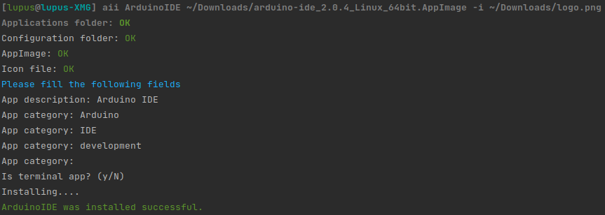

# AppImage installer
A simple tool to install Linux AppImage files.


The tool moves the AppImage file to HOME/Applications and creates a .desktop
configuration file.

## Installation
### Requirements
* python >= 3.7
* setuptools >= 61.0

### Local
1. Clone this repo
2. cd into repo root folder
3. ```python3 -m pip install .```

*Optional* install in edit mode with
```python3 -m pip install -e .```

### From GitHub
```pip3 install git+https://github.com/LupusCoding/appimageInstaller```

## Usage
After installation, you are able to execute the tool on command line, either
by using it's default name **appimageInstaller** or it's short name **aii**.<br/>
```appimageInstaller MyApp path/to/my.AppImage```
<br/>or<br/>
```aii MyApp path/to/my.AppImage```



It is *recommended* to always add an icon. Supported images are **PNG** and 
**SVG**.<br/>
It is *recommended* to use the **-i**/**--icon** option instead of the prompt,
for autocompletion support.
